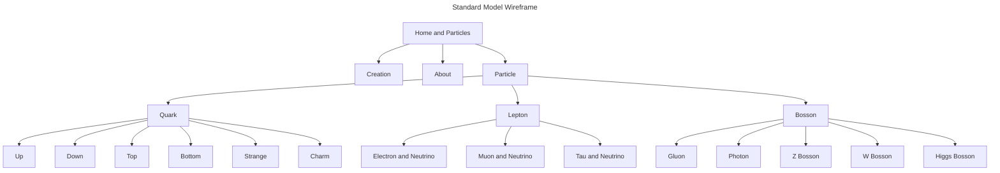

# 🖥 Standard Model Frontend

This is frontend service build with Rust and WASM.

Generated by [Yew Trunk Template](https://github.com/yewstack/yew-trunk-minimal-template). You need to install [Cargo Generate](https://github.com/cargo-generate/cargo-generate) to utilize `cargo generate` command.

```bash
cargo generate --git https://github.com/yewstack/yew-trunk-minimal-template
```

## 🎯 Goals

1. Who is the site for? For myself as a portfolio
2. What do they expect to find or do there? To find all standard model particles and their properties
3. Is this website’s primary aim to inform, to sell (ecommerce, anyone?), or to amuse? To inform my self
4. Does the website need to clearly convey a brand’s core message, or is it part of a wider branding strategy with its own unique focus? My focus is to learn and increase my skill with yew and wasm
5. What competitor sites, if any, exist, and how should this site be inspired by/different than, those competitors? Nope

## 👓 Scope

Only one page contain all particle properties. When the particle is clicked, it will zoom in to the particle

## 🗺 Wireframe


## ⚡️ Usage

For a more thorough explanation of Trunk and its features, please head over to the [repository][trunk].

### Installation

If you don't already have it installed, it's time to install Rust: <https://www.rust-lang.org/tools/install>.
The rest of this guide assumes a typical Rust installation which contains both `rustup` and Cargo.

To compile Rust to WASM, we need to have the `wasm32-unknown-unknown` target installed.
If you don't already have it, install it with the following command:

```bash
rustup target add wasm32-unknown-unknown
```

Now that we have our basics covered, it's time to install the star of the show: [Trunk].
Simply run the following command to install it:

```bash
cargo install trunk wasm-bindgen-cli
```

That's it, we're done!

### Running

```bash
trunk serve
```

Rebuilds the app whenever a change is detected and runs a local server to host it.

There's also the `trunk watch` command which does the same thing but without hosting it.

### Release

```bash
trunk build --release
```

This builds the app in release mode similar to `cargo build --release`.
You can also pass the `--release` flag to `trunk serve` if you need to get every last drop of performance.

Unless overwritten, the output will be located in the `dist` directory.

## 📚 References

* [Tutorial - Yew](https://yew.rs/docs/tutorial)
* [HTML Introduction](https://www.w3schools.com/html/html_intro.asp)
* [Sass Basics](https://sass-lang.com/guide)
* [Bootstrap Spacing (i.e pb-0)](https://getbootstrap.com/docs/4.0/utilities/spacing/)
* [Bulma Image (i.e is-1, is-3by1, is-rounded)](https://bulma.io/documentation/elements/image/)